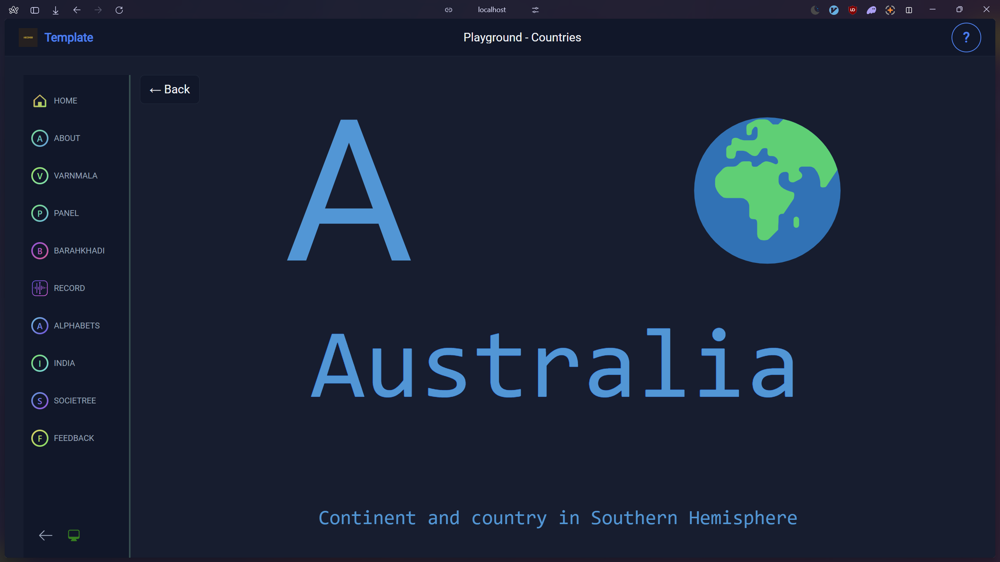

# Pages Documentation

This document describes the functionality and purpose of each page in the application.

## Main Pages

### About Page (/pages/about.astro)

- Simple about page explaining the purpose of the application
- Contains a description of interactive games for kids
- Includes help component explaining keyboard interaction

### Blog Pages

- **Index** (/pages/blog/index.astro)
  Lists all blog posts in a grid layout
- **Blog Post** (/pages/blog/[slug].astro)
  Individual blog post template
- **Blog Card** (/pages/blog/BlogCard.astro)
  Reusable component for blog previews

### Interactive Learning Pages

#### Alphabets Section

##### Alphabets Explorer Page (/pages/alphabets/index.astro)

- Main hub showing all available alphabet categories
- Cards with category icons, titles and descriptions
- Navigation to specialized playground and board pages for each category
- Animated card interactions and hover effects

##### Alphabet Playground (/pages/alphabets/[alphabet]/playground.astro)

- Interactive keyboard-driven learning experience
- Displays letters, emojis, and spelling animations based on key presses
- Dynamic color changes for visual engagement
- Category-specific content loaded based on URL parameter
- Includes help component explaining keyboard interaction

##### Alphabet Board (/pages/alphabets/[alphabet]/board.astro)

- Complete display of all letters in selected alphabet category
- Grid layout with letter cards showing detailed information
- Organized reference view for all category items
- Back navigation to main alphabets explorer

#### Varnmala Section

##### Varnmala Hub Page (/pages/varnmala/index.astro)

- Main hub for all alphabet learning activities
- Navigation to specialized practice pages
- Overview of available learning modes

##### Alphabet Display (/pages/varnmala/alphabet.astro)

- Displays Hindi and English alphabets
- Uses Alphabet component to render letter lists
- Includes help section explaining the concept

##### Typing Practice (/pages/varnmala/typing.astro)

- Interactive typing practice
- Shows letters, emojis, and spelling animations
- Responds to keyboard input (A-Z)
- Includes visual feedback

##### Reader (/pages/varnmala/reader.astro)

- Text-to-speech functionality
- Multiple speaker options (Mudra, Rutvi)
- Audio control for alphabet pronunciation
- Emoji display with letters

##### English Practice (/pages/varnmala/english.astro)

- English alphabet practice
- Color-changing letter display
- Keyboard interaction
- Visual feedback

#### Barahkhadi Page (/pages/barahkhadi/index.astro)

- Grid display of Hindi consonants organized in traditional groups
- Quick view popover showing barahkhadi variations for each consonant
- Interactive buttons to show/hide variations
- Clickable consonants leading to detailed pages
- Responsive layout with consonant groups

#### Panel Page (/pages/panel.astro)

- 3D rotating letter panel
- Arrow key navigation
- Custom HTML element (letter-panel)
- Interactive letter display

#### Record Page (/pages/record.astro)

- Audio recording functionality
- Visualization of audio input
- Controls for record/pause/stop
- Clip management with naming and deletion

#### Clan Explorer

- Family tree visualization tool
- Interactive legend with cultural elements:
  - Gotra (ancestral lineage)
  - Deity (family deity)
  - Caste information
  - Surname relationships

## Utility Pages

### Error Page (/pages/404.astro)

- Custom 404 error page
- Simple navigation guidance

### Legal Pages

- **Terms** (/pages/terms.astro)
  Terms and conditions page
- **Privacy** (/pages/privacy.astro)
  Privacy policy page

## Common Features

Most interactive pages include:

- Help component with instructions
- Keyboard interaction
- Visual feedback
- Consistent layout using BaseLayout
